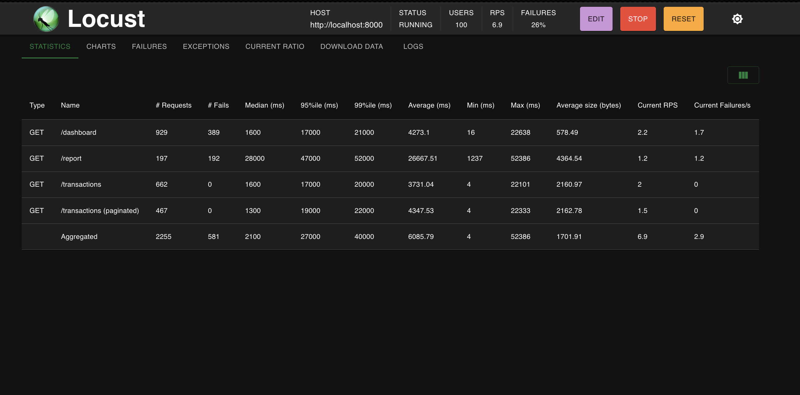
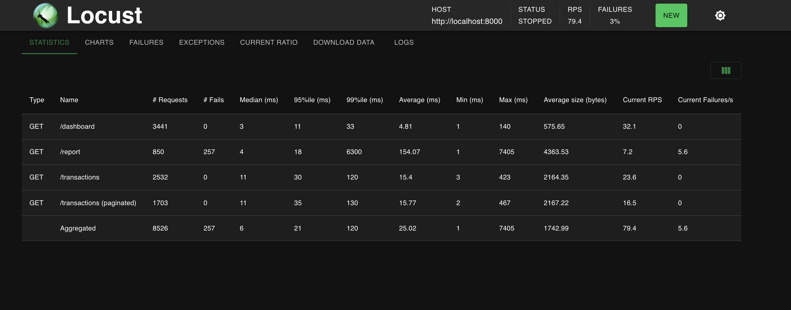

# LoadForge

I built this to understand what actually happens to a backend when you throw real load at it. The short answer: without indexes and caching, things fall apart fast.

The project simulates a multi-tenant SaaS backend — 5 tenants, 225k+ rows across transactions and events — and lets you watch query times go from seconds to milliseconds as you layer on optimizations.

---

## How it's structured

```
[Locust Load Generator]
        ↓
[FastAPI Backend]  ←→  [Redis Cache]
        ↓
[PostgreSQL DB]
(225k+ rows, 5 tenants)
```

| Component | Tech |
|-----------|------|
| API | FastAPI + Uvicorn |
| Database | PostgreSQL 15 |
| Cache | Redis 7 |
| Load Testing | Locust |

---

## Database

| Table | Rows |
|-------|------|
| tenants | 5 |
| users | 100 (20 per tenant) |
| transactions | 125,000 (25k per tenant) |
| events | 100,000 (20k per tenant) |

The tables are intentionally created without indexes first — that's the whole point. You feel the pain before you fix it.

---

## Running it locally

Everything runs locally, nothing paid.

### 1. Start Postgres and Redis

```bash
cd docker
docker compose up -d postgres redis
```

### 2. Install dependencies

```bash
python3.12 -m venv .venv
source .venv/bin/activate
pip install -r requirements.txt
```

### 3. Seed the database

```bash
cd loadforge
python -m scripts.seed_data
# takes ~60s, loads 225k+ rows
```

### 4. Start the backend

```bash
# from the project root (cloneForge Large DB management/)

# Phase 1 — no cache, no indexes
USE_CACHE=false USE_INDEXES=false uvicorn loadforge.backend.main:app --reload

# Phase 2 — cache on
USE_CACHE=true uvicorn loadforge.backend.main:app --reload

# Phase 3 — indexes + cache
USE_CACHE=true USE_INDEXES=true uvicorn loadforge.backend.main:app --reload
```

### 5. Run the load test (separate terminal)

```bash
locust -f loadforge/load_test/locustfile.py --host=http://localhost:8000
# open http://localhost:8089
# 100 users, spawn rate 10
```

---

## The three optimization phases

### Phase 1 — Baseline
No indexes, no cache. Every request does a full table scan across 125k transactions and 100k events filtered by tenant. Under 100 concurrent users, this breaks.

### Phase 2 — Redis cache
```bash
USE_CACHE=true uvicorn loadforge.backend.main:app --reload
```
Dashboard and report endpoints cache results for 30-60 seconds. Repeated hits skip the database entirely.

### Phase 3 — Composite indexes
```sql
CREATE INDEX idx_transactions_tenant_created ON transactions(tenant_id, created_at);
CREATE INDEX idx_transactions_tenant_status ON transactions(tenant_id, status);
CREATE INDEX idx_events_tenant_ts ON events(tenant_id, timestamp);
```
These make cold (uncached) queries fast too, so the cache warming period stops causing failures.

---

## Results (measured, not estimated)

These are real numbers from the load test at 100 concurrent users.

| Endpoint | No cache / No index | Cache enabled |
|----------|--------------------:|--------------:|
| /dashboard median | 1600ms | 3ms |
| /dashboard 95th %ile | 17000ms | 11ms |
| /report median | 28000ms | 4ms |
| /transactions median | 1600ms | 11ms |
| Overall RPS | 6.9 | 79.4 |
| Failure rate | 26% | 3% |

The `/report` endpoint went from 28 seconds median to 4ms. The throughput went from 6.9 to 79.4 requests/second.

### Load test screenshots

**Phase 1 — no cache, no indexes (26% failure rate, system under stress)**



**Phase 2 — Redis cache enabled (3% failures, 11x throughput)**



---

## Try the APIs

```bash
# dashboard (heavy — hits 3 queries)
curl "http://localhost:8000/dashboard?tenant_id=1"

# filtered transactions with cursor pagination
curl "http://localhost:8000/transactions?tenant_id=1&status=success&limit=20"

# heavy report (aggregation + join)
curl "http://localhost:8000/report?tenant_id=1"

# auto-generated API docs
open http://localhost:8000/docs
```

Every response includes a `query_time_ms` field so you can see the database time directly.

---

## What I learned

**Multi-tenancy and why indexes matter more than you think**
When one database serves multiple customers, every query filters by `tenant_id`. Without an index, Postgres scans all 125k rows just to find the ~25k belonging to one tenant. A composite index on `(tenant_id, created_at)` works like a phonebook sorted first by tenant then by date — Postgres jumps directly to the right rows instead of reading the whole table.

**Cache-aside pattern with Redis**
The app checks Redis before hitting the database. On a cache miss it queries Postgres, stores the result in Redis with a TTL (30-60s), and returns it. On a cache hit it skips the database entirely. This is why `/dashboard` went from 1600ms to 3ms — once the cache is warm, 90%+ of requests never touch Postgres. The tradeoff is stale data within the TTL window, which is acceptable for dashboard-style reads.

**Cursor-based pagination vs OFFSET**
`LIMIT 20 OFFSET 1000` forces Postgres to count and skip 1000 rows on every request — gets slower as you go deeper into the table. Cursor pagination (`WHERE id > :last_seen_id LIMIT 20`) lets Postgres jump straight to where you left off using the primary key index. Same result, but O(1) instead of O(n).

**What load testing actually reveals**
Testing one request at a time hides a class of bugs that only appear under concurrency — connection pool exhaustion, queries queuing behind each other, timeouts cascading. Locust showed the `/report` endpoint failing 98% of the time under 100 users even though it worked fine in isolation. The median response time was 28 seconds, not because the query was slow once, but because 100 slow queries were running simultaneously and blocking each other.

**Observability at the query level**
Every API response includes `query_time_ms` so you can see database time directly in the response. The optimizer module logs a `[SLOW QUERY]` warning with an index suggestion when any query exceeds 500ms. This is a minimal version of what APM tools like Datadog do — instrument first, then you have data to act on.
